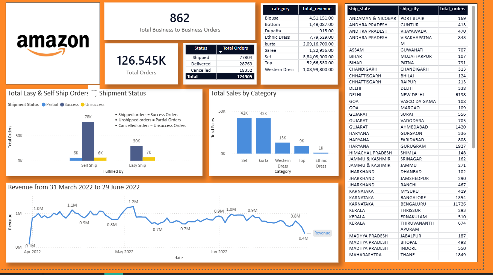

# Amazon Sales Analysis Dashboard
---
An End-to-End Sales Data Analysis Project on Amazon Sales.
Pipeline: Data Cleaning in *Python* -> Data Exploration in *SQL* -> Dashboard for Amazon B2B Sales in *PowerBI*.

---

## Data Source
---
*Note*:
  Due to file size limits, providing only Kaggle Dataset link.
  Here is the source link:
  https://www.kaggle.com/datasets/thedevastator/unlock-profits-with-e-commerce-sales-data
  *Brief Description of Dataset*
  - *Columns*: index, Order ID, Date, Status, Fulfilment, Sales Channel, ship-service-level, Style, SKU, Category, Size, ASIN, Courier Status, Qty, currency, Amount, ship-city, ship-state, ship-postal-code, ship-country, promotion-ids, B2B, fulfilled-by
  - *File Size*: 68.92 MB
  - *Time Period*: 31 March 2022 to 29 June 2022
---

## Workflow
- *Data Cleaning (Python)* : Handled missing values, standardized formats and preserved all columns.
- *Exploratory Analysis (SQL)* : Queries for order status, revenue by category, shipment performance.
- *Dashboard (PowerBI)*: Interactive visuals for KPIs, shipment success, category sales, revenue trends, geographic distribution.
---

  ## Key Insights
  - Sets & Kurtas contribute 80% of revenue.
  - Self Ship Orders are higher than Easy ship orders
  - Revenue got peaked on May 2022 and drops on June 2022.
  - Bengaluru & New Delhi are the most sold areas.
  - From April to June, Total 126.545k Orders made.
---

## Project Files
---
- /Datasets/Amazon Sale Report-Transformed.csv -> Transformed Dataset
- /Notebooks/Data_Cleaning.ipynb -> Python Cleaning Workflow
- /SQL/Database_Schema.sql -> Schema of data stored in PostgreSQL
- /SQL/Amazon_sales_EDA.sql -> SQL Queries if Exploration
- /Visualizations/Sales_Dashboard.pbix -> PowerBI Dashboard file
- /Visualizations/Sales_Dashboard_ScreenShot.png  -> Screenshot of Dashboard
- README.md -> Documentation
---

## Acknowledgement
---
- Kaggle Dataset contributors.
- Tools used: Python, PostgreSQL and PowerBI
